Website #1 - Startempire Wire (Parent Membership Website) [ https://startempirewire.com ]
- WordPress / MemberPress (Primary Auth / Integrated With WordPress Auth Shared Across Network) & Buddyboss Powered Parent Website
- Shared Network Authentication.
- Authentication Flow:  User Logs into the network (once) via one method and has full access to all features and sites of the network.
-- PRIMARY AUTH: WordPress Auth Shared Across Network
-- SECONDARY AUTH: OAuth & OpenID Connect Shared Across Network
-- TERTIARY AUTH: Discord Auth Shared Across Network
- Uses MemberPress + WordPress User Roles to Handle Startempire Wire Membership Levels (Role Based: Free (Non-Verified - Public Access), FreeWire, Wire, ExtraWire), Access to Website Content & Payments Processing
- Houses Canonical User Level/Role Based Premium Content that will be distributed to the Ring Leader Plugin then to the UI of Startempire Wire Network Connect Plugin & The Startempire Wire Network Chrome Extension. 
- Content & Data To be served via WordPress REST API to Ring Leader Plugin Includes:
-- Network Member User Levels (Role Based: Free (Non-Verified - Public Access), FreeWire, Wire, ExtraWire)
-- Network Member User Data (Name, Email, Website, Logo, Description, Membership Level, etc...)
-- Message Boards (/message-boards)
-- Regular & Premium Articles (/articles)
-- Original Startempire Wire Podcasts (/audio-podcasts & /video-podcasts)
-- Local & Virtual Event Calendar (/events)
-- Startempire Wire Member (/entrepreneur) Directory (/directory)

Website #2 - Startempire Wire Network Website [ https://startempirewire.network ]
- Handles the distribution & downloads of Startempire Wire Network software
-- Startempire Wire Network Connect Plugin / or Component (for JS frameworks)
-- Chrome Extension - Startempire Wire Network Chrome Extension
- Houses the Documentation, Instruction & How-To of Startempire Wire Network Software
- Handles Promotion & Marketing of the Startempire Wire Network
- Startempire Wire Network Screenshots Plugin Installed here to serve as a Screenshots Service to the Startempire Wire Network Connect Plugin & Startempire Wire Network Chrome Extension
- Startempire Wire Network Ring Leader Plugin Installed here to serve as the messenger of The Parent Membership Website of The Network & Creates End Points For the Data Distribution to the Startempire Wire Network Connect Plugin & Startempire Wire Network Chrome Extension
- Handles distribution of data retrieved from the Startempire Wire Website [https://startempirewire.com] via WordPress REST API between different parts of the network via the Startempire Wire Network Ring Leader Plugin

WordPress Plugin #1 - Startempire Wire Network Ring Leader Plugin (Modern Web Ring)
- CODE: https://github.com/Startempire-Wire/Startempire-Wire-Network-Ring-Leader.git
- Singularly Unique Plugin that acts as the messenger of The Parent Membership Website of The Network & Creates A Modern Web Ring [ https://startempirewire.com ]
- Installed on the Startempire Wire Network Website [ https://startempirewire.network ]
- Retrieves ALL Data from the Startempire Wire Website [https://startempirewire.com] via WordPress REST API Endpoints. 
- Handles Authentication (via WordPress User Authentication (Primary Authentication), BuddyPress / BuddyBoss User Authentication, Discord Authentication, OAuth & OpenID Connect) & data distribution between:  
--- Startempire Wire Website [https://startempirewire.com] => the Startempire Wire Network Ring Leader Plugin, 
--- Startempire Wire Network [https://startempirewire.network] => the Startempire Wire Network Ring Leader Plugin,
--- the Startempire Wire Network Ring Leader Plugin => the Startempire Network Connect Connect Plugin (Plugin #2) [ Located on Multiple Network Members Sites ], 
--- the Startempire Wire Network Ring Leader Plugin => The Startempire Network Chrome Extension
- Accounts for Custom Content Type Distribution to Associated Network Members based on their membership level (Role Based: Free (Non-Verified - Public Access), FreeWire, Wire, ExtraWire)
- Accesses Content from the Startempire Wire Website [https://startempirewire.com] to display in the Startempire Wire Network Connect Plugin & Startempire Wire Network Chrome Extension
- Records Statistics of Network & Creates Easy ways to Display Data on the Frontend & Dashboard of the Network & Member Websites & Chrome Extension
- Administers A Central List of Businesses In The Network
-- Ability to Moderate new Member Registrations
-- Sends Notification Emails of Member Status (Pending, Approved, Rejected)
-- Accepts New Member Registrations
- Creates new API Endpoints For Data Distribution To Connect to Startempire Network Connect Plugin
- Creates new API Endpoints For Data Distribution To Connect to Startempire Network Chrome Extension

WordPress Plugin #2 - Startempire Wire Network Connect Plugin / or Component (for JS frameworks)
- CODE: https://github.com/Startempire-Wire/Startempire-Wire-Network-Connect.git
- Connects to Startempire Wire Network Ring Leader Plugin and reads the data from the Ring Leader Plugin to display in the Startempire Wire Network Connect Plugin & Startempire Wire Network Chrome Extension
- The Distributed Network Plugin or Component (For Js Frameworks) that will allow Startempire Network Members to Connect Their Website to the Startempire Wire Network (via OAuth or something similar)
- Once a member has applied and been accepted into the Startempire Wire Network (Either as An Original Startempire Wire Community Member or Directly to the Network from the Website) They will Have access as a Member to Benefits based on their membership level.
- Free Level (Free (Non-Verified - Public Access) No Membership) : View Public Access Global content in Feed (UI Created by Chrome Extension)
- Free Level (FreeWire Membership, Moderated & Approved) : Network Exposure & Brand Distribution, 
- Paid Level (Wire Membership & Approved) :  Official Wire Member Level Badge, Secondary Preference in Content Exposure Algorithm, Wire Level member Features in Chrome Extension & Wirebot
- Paid Level (ExtraWire Membership & Approved) :  Official ExtraWire Member Level Badge, Primary Preference in Content Exposure Algorithm, Wire Level member Features in Chrome Extension & Wirebot
- Gives the option to Creates popup Overlay UI on members Website to allow for navigation through network content available to free non-member users.

WordPress Plugin #3 - Startempire Wire Network Screenshots
- CODE: https://github.com/Startempire-Wire/Startempire-Wire-Network-Screenshots.git
- This WordPress plugin provides a robust solution to capture, cache, and deliver screenshots through both local and external fallback methods. Its central purpose is to serve as part of the Startempire Wire software ecosystem, particularly integrating with and supporting the “Startempire Wire Network Chrome Extension” for capturing and displaying website screenshots.
• Provides REST API endpoints for external services and front-end modules (including the Chrome Extension) to request screenshots of URLs.  
• Offer local screenshot generation using wkhtmltoimage (or potentially the Chrome-php library) for faster, direct captures.  
• Support third-party fallback APIs (such as Screenshot Machine) for situations where local generation fails or is disabled.  
• Secure screenshot requests and usage through API Key or membership token verification (including partial or advanced premium membership checks).  
• Cache and store the generated screenshots in a local directory or remote storage, serving them quickly on future requests.  
• Maintain an administrative dashboard within WordPress to configure the screenshot service, fallback settings, API keys, and test functionality.

Additional Service Details:
- API Access Tiers:
  * Free (Non-Verified - Public Access)
    - Basic screenshot service
    - Limited rate: 30/hour
    - Basic quality: 1280x720 JPEG
    - No authentication required
  * Direct API Consumers (paid service)
    - Standard/Premium tiers
    - API key authentication from Screenshots Plugin
    - Tier-based limits and quality
  * Network Members (via Ring Leader)
    - FreeWire/Wire/ExtraWire tiers
    - WordPress Token-based authentication
    - Membership-based quality
  * Admin Access
    - Full service control
    - WordPress authentication

- Quality Specifications:
  * Standard: 1280x720 JPEG
  * Premium: 1920x1080 WebP
  * Enterprise: 2560x1440 WebP

- Integration Points:
  * Ring Leader Plugin
    - Authentication relay
    - Cache coordination
    - Network-wide operations
  * External API Consumers
    - Direct API key access
    - Service level agreements
    - Usage monitoring
  * Chrome Extension
    - Real-time preview generation
    - Cache utilization
    - Quality adaptation


WordPress Plugin #4 - Startempire Wire Network Websockets
- CODE: https://github.com/Startempire-Wire/Startempire-Wire-Network-Websockets.git
- Handles the Websocket Server for the entire Startempire Wire Network
- Uses Node.js & Socket.io to create a robust websocket server with a focus on performance, scalability, ease of use, comprehensive documentation, & a robust admin dashboard.
- Uses AsyncAPI to describe our WebSocket-based APIs (https://www.asyncapi.com/)
- Startempire Wire Network Chrome Extension duties: 
-- Enables data streaming from the Startempire Wire Network Ring Leader Plugin to the Startempire Wire Network Chrome Extension
-- Enables data streaming from the Startempire Wire Network Ring Leader Plugin to the Startempire Wire Network Connect Plugin
-- Facilitates one to one & one to many connections for the entire Startempire Wire Network while maintaining an agnostic setup that can be used on any server or service. 
--- Connection Types: 
---- User -> User in Chrome Extension (Direct Messaging)
---- Parent Website -> Ring Leader -> Chrome Extension
---- Parent Website -> Ring Leader -> Connect Plugin
---- Connect Plugin -> Ring Leader -> Chrome Extension
---- Connect Plugin -> Ring Leader -> Parent Website
---- Chrome Extension -> Ring Leader -> Parent Website
---- Chrome Extension -> Ring Leader -> Connect Plugin
---- Chrome Extension -> Ring Leader -> Chrome Extension
- Maintains a list of all connections in the entire Startempire Wire Network or whatever network the plugin is installed on.
- Offers a robust set of REST API Endpoints for external services to consume for monitoring, analytics, and more.
- Full Admin UI gives granular control & management of the websocket server and the APIs it offers.

Chrome Extension - Startempire Wire Network Chrome Extension
- CODE: https://github.com/Startempire-Wire/Startempire-Wire-Network-Chrome-Extension.git
- Connects to Startempire Wire Network Ring Leader Plugin and reads + displays data relevant to the user's membership level (Free (Non-Verified - Public Access), FreeWire, Wire, ExtraWire)
- Streams User specific data or promotional content from StartempireWire Parent Site
- Streams User specific data or promotional content from Startempire Wire Network
- Integration of Discord Live Streaming & Chat (Possibly Separate Tab integrated via Discord.js)
- Displays User Level (Free (Non-Verified - Public Access), FreeWire, Wire, ExtraWire) Specific Content to Overlay UI Created in Browser tab for users to Navigate (Popup Overlay)
- Display Network & User Statistics & Trends
- - Network Statistics: New Sites In Network
- - Network Statistics: New Businesses in Category
- - Network Statistics: Total Sites in Network
- Allows for users to navigate the Startempire Wire Network & Content (Modern Web Ring)

### Authentication Flow:
Request → Authentication Check:
  ├─ WordPress Admin? → Allow All Access
  ├─ Valid API Key? → Apply API Tier Limits
  └─ Ring Leader Token? → Trust Ring Leader's Tier Assignment
  └─ No Auth → Apply Free (Non-Verified - Public Access) Tier Limits

# Operational Patterns & Integration Guide

## Core System Patterns & Integration

### Content Distribution Architecture

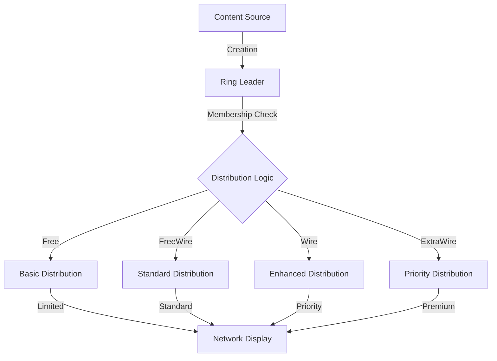

### Distribution & Integration Flow
1. **Content Processing**
   - Initial Publication
     * Content created on parent site
     * Metadata enrichment
     * Classification by type
     * Membership level assignment
   
   - Distribution Rules
     * Free: Basic visibility
     * FreeWire: Standard distribution
     * Wire: Enhanced with secondary algorithm
     * ExtraWire: Priority with primary algorithm

2. **System Integration**
   - Component Communication
     * Ring Leader orchestration
     * Connect Plugin distribution
     * Chrome Extension updates
     * Screenshot service integration

### Service Integration Pattern

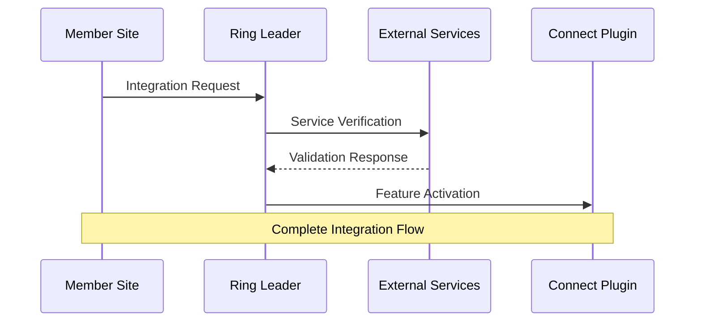

### Integration Mechanics
1. **External Services**
   - Discord Integration
     * Real-time chat/streaming
     * User synchronization
     * Event broadcasting
     * Status management
   
   - BuddyBoss Integration
     * User profiles/social
     * Group management
     * Activity tracking
     * Content sharing
   
   - MemberPress Integration
     * Payment processing
     * Subscription management
     * Access control
     * Feature unlocks

2. **Feature Activation**
   - Membership Triggers
     * Level changes
     * Payment verification
     * Trial activation
     * Special access
   
   - System Response
     * Permission updates
     * Feature enablement
     * UI adaptation
     * API access adjustment

## Network Analytics & Member Success

### Analytics Architecture

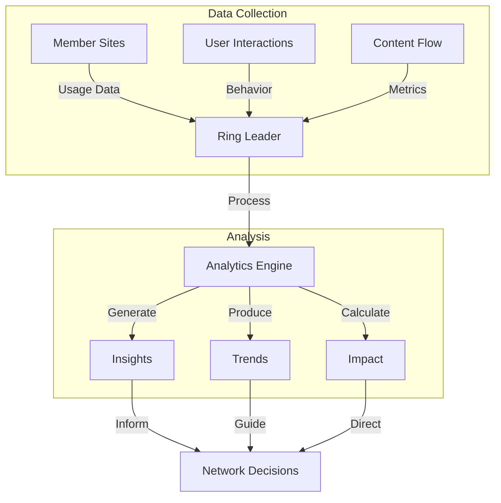

### Analytics Implementation
1. **Data Collection Strategy**
   - Member Metrics
     * Engagement rates
     * Content distribution success
     * Feature utilization
     * Growth patterns
   
   - Network Metrics
     * Overall health
     * Distribution efficiency
     * System performance
     * Integration effectiveness

2. **Analysis Patterns**
   - Business Intelligence
     * Member success indicators
     * Network growth trends
     * Value delivery metrics
     * ROI measurements
   
   - Technical Analysis
     * Performance patterns
     * Usage optimization
     * Resource utilization
     * System efficiency

### Member Success Flow

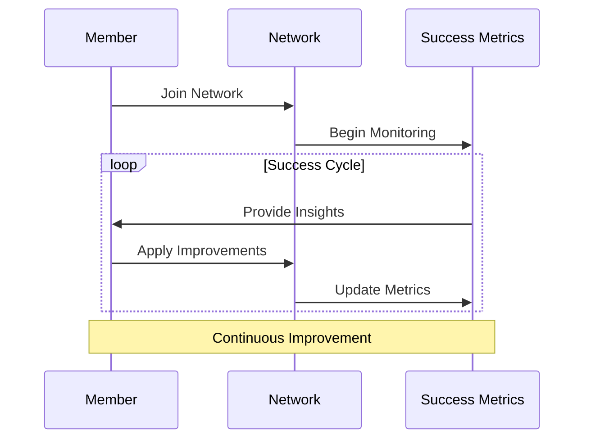

### Success Implementation
1. **Member Journey Tracking**
   - Onboarding Phase
     * Integration completion
     * Feature adoption
     * Initial engagement
     * Early success indicators
   
   - Growth Phase
     * Engagement deepening
     * Feature utilization
     * Value realization
     * Network contribution

2. **Success Metrics**
   - Business Impact
     * Traffic increases
     * Engagement growth
     * Content reach
     * Network value
   
   - Technical Success
     * Integration stability
     * Feature utilization
     * Performance metrics
     * System reliability

### Network Intelligence

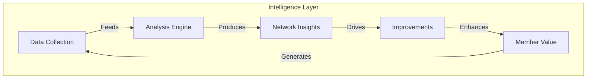

### Intelligence Implementation
1. **Data Utilization**
   - Strategic Insights
     * Network trends
     * Growth opportunities
     * Value optimization
     * Member needs
   
   - Operational Intelligence
     * Resource optimization
     * Performance tuning
     * Feature prioritization
     * System evolution

## Testing Strategy & Performance Optimization

### Network-Wide Testing Architecture

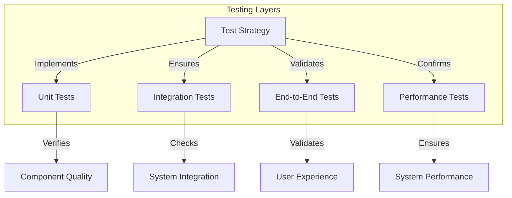

### Testing Implementation
1. **Component Testing**
   - Unit Test Coverage
     * Core plugin functions
     * API endpoints
     * Authentication flows
     * Data handling
   
   - Integration Testing
     * Cross-plugin communication
     * External service integration
     * Data synchronization
     * Error handling

2. **System Testing**
   - End-to-End Validation
     * User journeys
     * Feature workflows
     * Content distribution
     * Member interactions
   
   - Performance Testing
     * Load handling
     * Response times
     * Resource usage
     * Scalability limits

### Performance Optimization Pattern

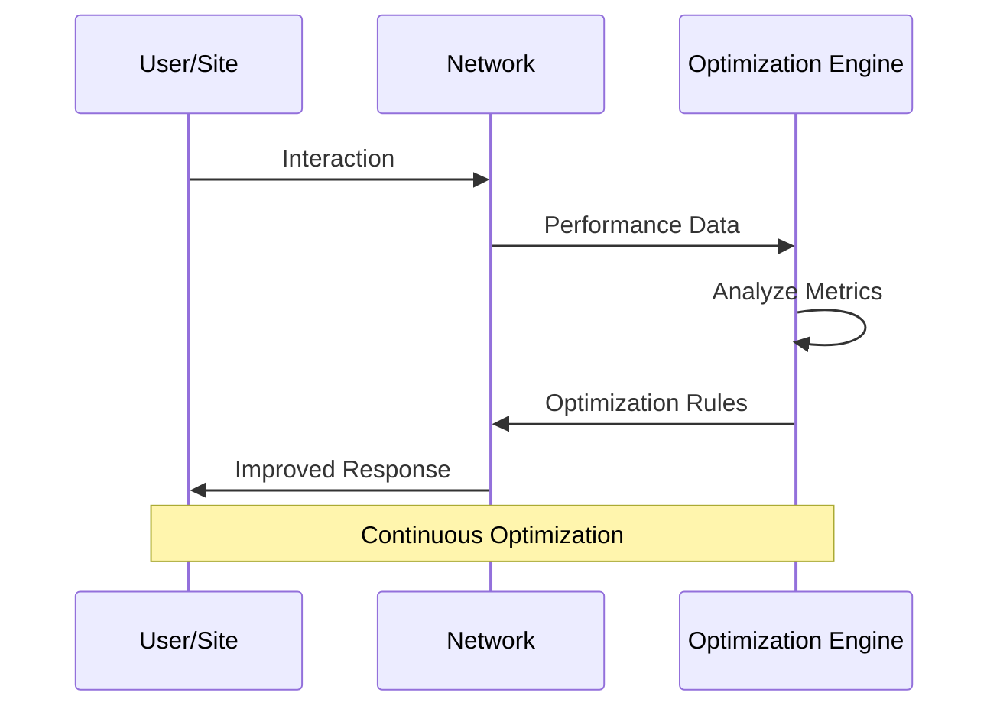

### Optimization Implementation
1. **Resource Management**
   - Caching Strategy
     * Content caching
     * API response caching
     * Image optimization
     * Static resource delivery
   
   - Load Distribution
     * Request routing
     * Resource balancing
     * Traffic management
     * Capacity planning

2. **Performance Monitoring**
   - Real-Time Metrics
     * Response times
     * Resource utilization
     * Error rates
     * User experience scores
   
   - Optimization Triggers
     * Performance thresholds
     * Usage patterns
     * System capacity
     * User feedback

### System Optimization Flow

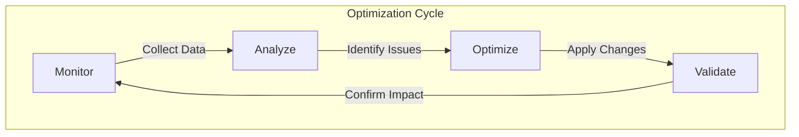

### Optimization Strategy
1. **Performance Baseline**
   - Core Metrics
     * Page load times
     * API response times
     * Resource usage
     * Error frequency
   
   - User Experience
     * Interface responsiveness
     * Feature accessibility
     * Content delivery speed
     * System reliability

2. **Continuous Improvement**
   - Optimization Cycles
     * Performance analysis
     * Issue identification
     * Solution implementation
     * Impact validation
   
   - System Evolution
     * Architecture refinement
     * Resource optimization
     * Feature enhancement
     * Scalability improvement

## Member Journey & Network Growth

### Member Onboarding Flow

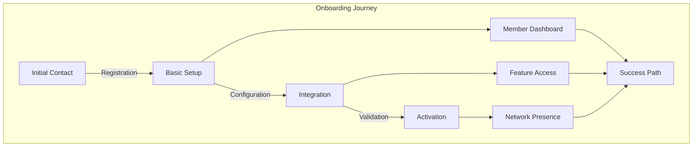

### Onboarding Implementation
1. **Initial Setup Phase**
   - Registration Process
     * Account creation
     * Domain verification
     * Profile completion
     * Integration preparation
   
   - Basic Configuration
     * Plugin installation
     * Initial settings
     * Feature selection
     * Connection testing

2. **Integration Phase**
   - Technical Setup
     * API configuration
     * Authentication setup
     * Content sync
     * Feature activation
   
   - Validation Steps
     * Connection testing
     * Feature verification
     * Performance check
     * Security validation

### Network Growth Pattern

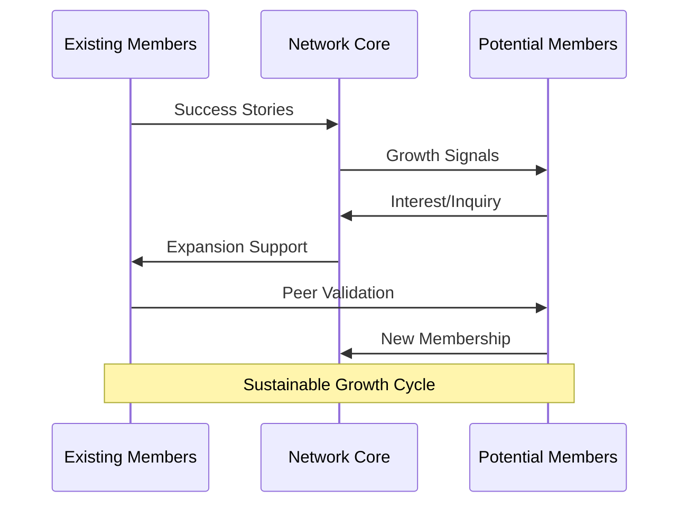

### Growth Implementation
1. **Expansion Strategy**
   - Member Acquisition
     * Value demonstration
     * Success sharing
     * Feature highlighting
     * Integration support
   
   - Network Development
     * Capacity planning
     * Feature evolution
     * Service enhancement
     * Performance scaling

2. **Growth Management**
   - Resource Allocation
     * Infrastructure scaling
     * Support enhancement
     * Feature development
     * Performance optimization
   
   - Quality Maintenance
     * Service standards
     * Performance metrics
     * Member satisfaction
     * Network health

### Integration Validation Pattern

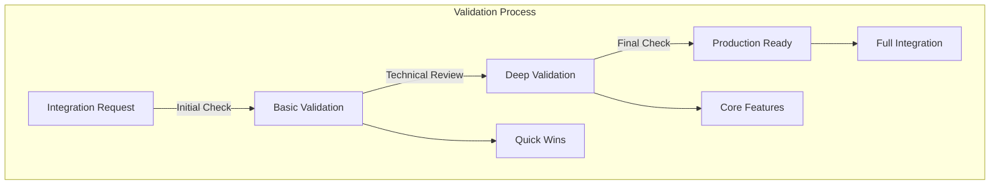

### Validation Implementation
1. **Technical Validation**
   - Connection Testing
     * API endpoints
     * Authentication flow
     * Data synchronization
     * Feature availability
   
   - Performance Validation
     * Response times
     * Resource usage
     * Error handling
     * Scalability check

2. **Business Validation**
   - Value Delivery
     * Feature access
     * Content distribution
     * Network benefits
     * Growth support
   
   - Success Metrics
     * Integration completion
     * Feature utilization
     * Member satisfaction
     * Network contribution

## System Maintenance & Troubleshooting

### Troubleshooting Flow Pattern

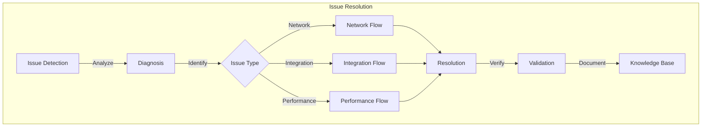

### Troubleshooting Implementation
1. **Issue Detection & Analysis**
   - Monitoring Triggers
     * Error patterns
     * Performance degradation
     * Integration failures
     * User reports
   
   - Diagnostic Process
     * Log analysis
     * System checks
     * Integration tests
     * User impact assessment

### Maintenance Strategy Pattern

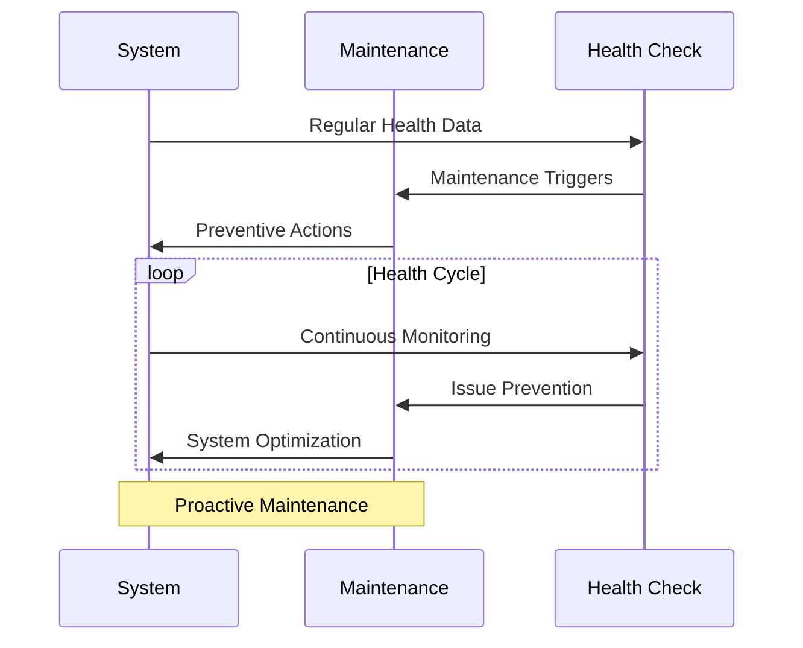

### Maintenance Implementation
1. **Preventive Maintenance**
   - Regular Checks
     * System health
     * Performance metrics
     * Integration status
     * Resource utilization
   
   - Proactive Updates
     * Security patches
     * Performance optimization
     * Feature updates
     * System scaling

### Health Monitoring Pattern

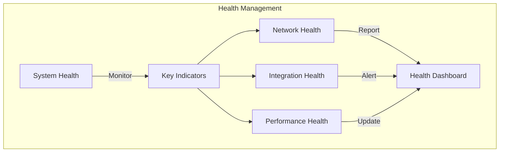

### Recovery Implementation
1. **System Recovery**
   - Recovery Procedures
     * Service restoration
     * Data consistency
     * Integration repair
     * Performance recovery
   
   - Prevention Measures
     * Backup systems
     * Failover procedures
     * Data protection
     * System redundancy

2. **Health Management**
   - Monitoring Strategy
     * Real-time metrics
     * Trend analysis
     * Predictive alerts
     * Impact assessment
   
   - Response Planning
     * Issue prioritization
     * Resource allocation
     * Communication flow
     * Recovery validation

## Network Scalability & Feature Deployment

### Scalability Architecture

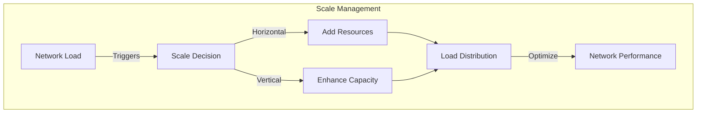

### Scalability Implementation
1. **Growth Management**
   - Resource Scaling
     * Load monitoring
     * Capacity planning
     * Resource allocation
     * Performance optimization
   
   - Network Expansion
     * Member growth handling
     * Content scaling
     * Feature availability
     * Service reliability

### Feature Deployment Pattern

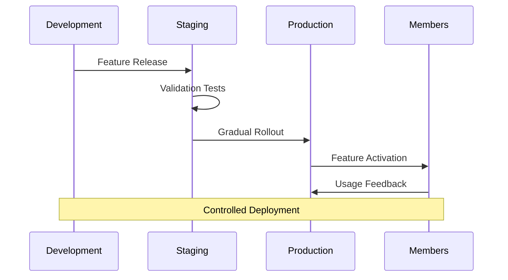

### Deployment Implementation
1. **Release Strategy**
   - Feature Preparation
     * Version control
     * Documentation
     * Testing coverage
     * Rollback planning
   
   - Deployment Process
     * Staged rollout
     * Feature flags
     * Impact monitoring
     * User communication

2. **Integration Management**
   - System Updates
     * Component synchronization
     * API version control
     * Database migrations
     * Cache management
   
   - Member Impact
     * Service continuity
     * Feature availability
     * Performance stability
     * User experience

### Network Communication Flow

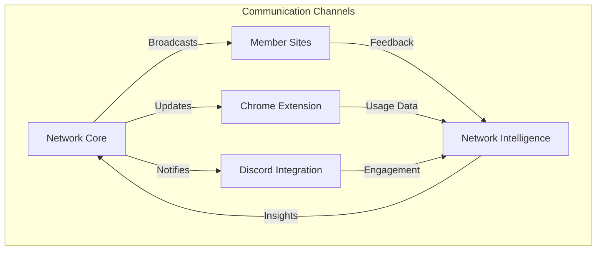

### Communication Implementation
1. **Message Distribution**
   - Network Updates
     * Feature announcements
     * System changes
     * Performance updates
     * Maintenance notices
   
   - Member Engagement
     * Success stories
     * Best practices
     * Network insights
     * Growth opportunities

2. **Feedback Channels**
   - Data Collection
     * Usage patterns
     * Feature adoption
     * Performance metrics
     * User satisfaction
   
   - Response Management
     * Issue resolution
     * Feature requests
     * System improvements
     * Network enhancements

## Network Resilience & Business Continuity

### Resilience Architecture

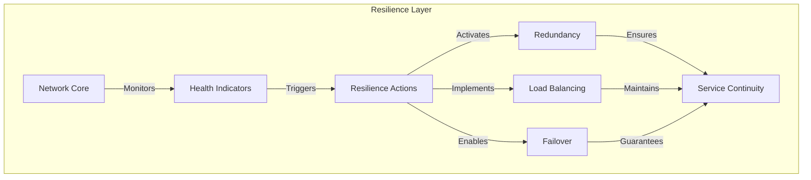

### Resilience Implementation
1. **System Hardening**
   - Infrastructure Protection
     * Redundant systems
     * Geographic distribution
     * Resource isolation
     * Failure detection
   
   - Service Protection
     * Circuit breakers
     * Rate limiting
     * Request queuing
     * Load shedding

### Business Continuity Pattern

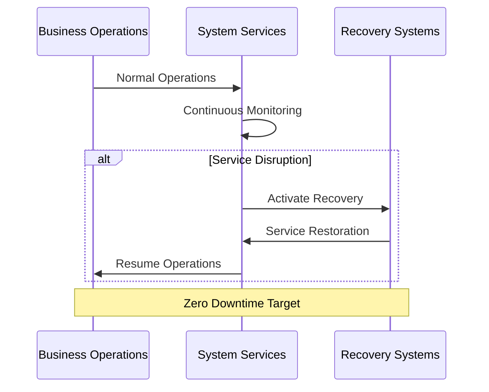

### Continuity Implementation
1. **Operation Protection**
   - Service Continuity
     * Critical path protection
     * Service prioritization
     * Resource reservation
     * Impact minimization
   
   - Business Functions
     * Member services
     * Content delivery
     * Network operations
     * Value delivery

### Value Optimization Flow

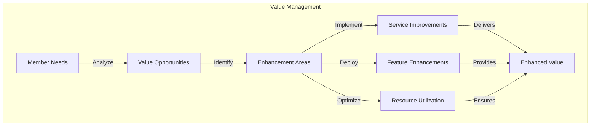

### Optimization Implementation
1. **Value Delivery**
   - Service Enhancement
     * Feature optimization
     * Performance improvement
     * Integration efficiency
     * User experience
   
   - Resource Management
     * Capacity optimization
     * Cost efficiency
     * Resource allocation
     * System utilization

2. **Adaptation Strategy**
   - System Evolution
     * Technology adoption
     * Feature modernization
     * Integration updates
     * Performance tuning
   
   - Business Alignment
     * Member needs
     * Market demands
     * Growth requirements
     * Value propositions

## Network Governance & Quality Assurance

### Governance Architecture

```mermaid
graph TD
    subgraph "Governance Framework"
        A[Network Standards] -->|Enforces| B[Quality Controls]
        A -->|Guides| C[Member Policies]
        A -->|Maintains| D[System Integrity]
        
        B --> E[Network Quality]
        C --> F[Member Compliance]
        D --> G[System Health]
        
        E --> H[Network Excellence]
        F --> H
        G --> H
    end
```

### Governance Implementation
1. **Network Standards**
   - Quality Guidelines
     * Content standards
     * Technical requirements
     * Integration policies
     * Performance benchmarks
   
   - Member Policies
     * Participation rules
     * Content guidelines
     * Technical compliance
     * Service standards

### Evolution Implementation
1. **System Evolution**
   - Innovation Pipeline
     * Feature research
     * Prototype development
     * Member feedback
     * Implementation strategy
   
   - Growth Management
     * Capacity evolution
     * Service expansion
     * Feature maturity
     * Network advancement

2. **Ecosystem Development**
   - Network Growth
     * Member expansion
     * Service enhancement
     * Feature development
     * Value creation
   
   - Future Planning
     * Technology roadmap
     * Feature pipeline
     * Growth strategy
     * Value evolution